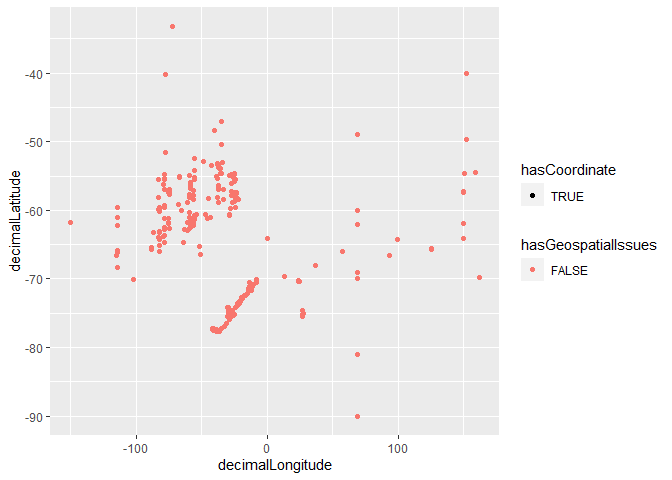
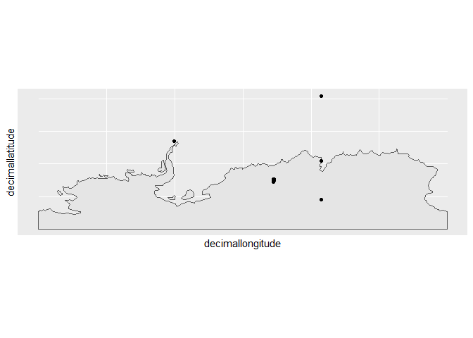
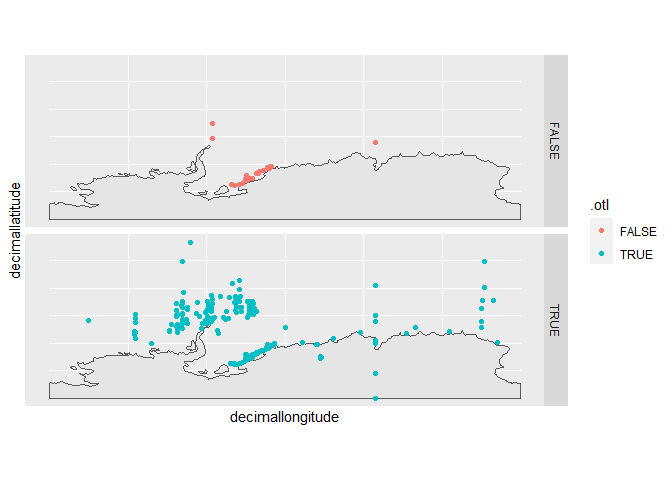
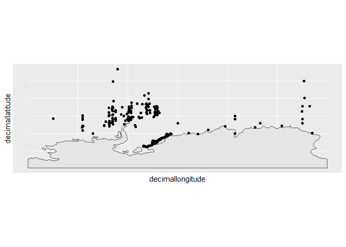

Data Quality Control
================
Denisse Fierro Arcos
2023-09-23

- [Quality Control (QC) workflow](#quality-control-qc-workflow)
  - [Setting up GBIF credentials](#setting-up-gbif-credentials)
  - [Loading libraries](#loading-libraries)
  - [Downloading data from GBIF](#downloading-data-from-gbif)
  - [Loading data](#loading-data)

# Quality Control (QC) workflow

In this document, we will apply a quality control workflow to the
[Antarctic
Phipoda](https://ipt.biodiversity.aq/resource?r=2438_mista_ant_phipoda#anchor-downloads)
dataset available from GBIF. It should be noted that this dataset can be
directly downloaded from the IPT using the `curl` library. However, I
chose to use the `rgbif` package because it downloads the dataset from
GBIF, which includes additional columns in the dataset that can help
identify issues faster.

Before being able to use this notebook to download data from GBIF, you
need to get a free [GBIF](https://www.gbif.org/) account. Find your
account details because you will need to share them with `R` as shown in
the next chunk of code.

This document can also be used as a report for quality control findings.

## Setting up GBIF credentials

Write your GBIF credentials in the section below. Once you are done,
copy them.

GBIF_USER=“WRITE-YOUR-USERNAME”  
GBIF_PWD=“WRITE-YOUR-PASSWORD”  
GBIF_EMAIL=“WRITE-YOUR-EMAIL”

Ensure the information given above refers to your GBIF account. Copy it,
run the chunk of code below. This will open a new window with the name
`.Renviron`. Paste your details in this window, save it, close it, and
restart `R`.

``` r
usethis::edit_r_environ()
```

You only need to set up your credentials once, so if you have already
done this before, there is no need to do it again. Now you can run the
code below with no issues.

## Loading libraries

``` r
#Data manipulation and plotting
library(tidyverse)
library(janitor)
#Downloading GBIF data and data cleaning
library(rgbif)
library(CoordinateCleaner)
#Basemaps
library(rnaturalearth)
```

## Downloading data from GBIF

First, we will provide the path to the folder where where we will store
our data. We will call this folder `Data`, and it will be located in the
main repository folder. If this folder does not yet exist, we will
create it.

``` r
#Defining location of data folder
folder_out <- "../Data"

#Checking if folder exists, if not, one will be created
if(dir.exists(folder_out) == F){
  dir.create(folder_out)
}
```

We are now ready to download our data using the `rgbif` package. From
the [dataset
page](https://ipt.biodiversity.aq/resource?r=2438_mista_ant_phipoda#anchor-downloads),
we will find the dataset ID or GBIF UUID. In this case, it is
`667e0044-3ff1-4365-8ecf-e637c7b31fa4`. We will use this information to
find and download the data.

``` r
#Find the Antarctic Phipoda dataset
dataset_conn <- occ_download(pred("datasetKey", "667e0044-3ff1-4365-8ecf-e637c7b31fa4"))
```

This make take a few minutes. You can check the status of download using
`occ_download_wait(dataset_conn)`. Once it has SUCCEEDED, you can
download it.

``` r
#We will download the data locally and also load it to a variable
ant_phipoda <- occ_download_get(dataset_conn, path = folder_out) %>%
    occ_download_import()
```

The code above downloaded the data locally as a zip file, but it also
loaded the data in the `ant_phipoda` variable. The section below shows
how to extract data from a zip file using base `R`.

``` r
#We will unzip the file in a new subfolder
path_out <- file.path(folder_out, "Antarctic_Phipoda")

#Unzipping files into the data folder
zip_path <- list.files(folder_out, ".zip", full.names = T)
unzip(zip_path, exdir = path_out)

#Finally, we will get a list of all files downloaded
file_list <- list.files(path = path_out, full.names = T)
#We can check results now
file_list
```

    ## [1] "../Data/Antarctic_Phipoda/0005510-230918134249559.csv"
    ## [2] "../Data/Antarctic_Phipoda/citations.txt"              
    ## [3] "../Data/Antarctic_Phipoda/dataset"                    
    ## [4] "../Data/Antarctic_Phipoda/meta.xml"                   
    ## [5] "../Data/Antarctic_Phipoda/metadata.xml"               
    ## [6] "../Data/Antarctic_Phipoda/multimedia.txt"             
    ## [7] "../Data/Antarctic_Phipoda/occurrence.txt"             
    ## [8] "../Data/Antarctic_Phipoda/rights.txt"                 
    ## [9] "../Data/Antarctic_Phipoda/verbatim.txt"

We can see that this dataset has a relatively simple structure as it
only contains one core file: `occurrence.txt`, which contains
information about where Antarctic Phipoda has been recorded. In this
case, we can go ahead and load the `occurrence.txt` into our
environment. The `xml` files provide metadata, which will not be looking
into in this repository.

## Loading data

``` r
#Loading data
ant_phipoda <- read_delim(str_subset(file_list, "occurrence"), delim = "\t")
```

    ## Warning: One or more parsing issues, call `problems()` on your data frame for details,
    ## e.g.:
    ##   dat <- vroom(...)
    ##   problems(dat)

    ## Rows: 1808 Columns: 212
    ## ── Column specification ────────────────────────────────────────────────────────
    ## Delimiter: "\t"
    ## chr   (36): language, license, collectionCode, basisOfRecord, dynamicPropert...
    ## dbl   (15): gbifID, organismQuantity, decimalLatitude, decimalLongitude, dep...
    ## lgl  (157): accessRights, bibliographicCitation, publisher, references, righ...
    ## dttm   (4): modified, lastInterpreted, lastParsed, lastCrawled
    ## 
    ## ℹ Use `spec()` to retrieve the full column specification for this data.
    ## ℹ Specify the column types or set `show_col_types = FALSE` to quiet this message.

We are getting a warning about issues with the data, we will check them
now and correct them.

``` r
#Checking issues
problems(ant_phipoda)
```

    ## # A tibble: 3 × 5
    ##     row   col expected           actual                file                     
    ##   <int> <int> <chr>              <chr>                 <chr>                    
    ## 1  1511   178 1/0/T/F/TRUE/FALSE 4.424179327278187E-10 C:/Users/ldfierro/Docume…
    ## 2  1516   178 1/0/T/F/TRUE/FALSE 4.424179327278187E-10 C:/Users/ldfierro/Docume…
    ## 3  1794   178 1/0/T/F/TRUE/FALSE 4.424179327278187E-10 C:/Users/ldfierro/Docume…

We will look at the contents of the variables with issues. First we will
find the name of `column 178`.

``` r
names(ant_phipoda)[178]
```

    ## [1] "distanceFromCentroidInMeters"

Based on the column name, `distanceFromCentroidInMeters`, this column
should not be of boolean type as seen in the `expected` column of the
problems identified. In this case, we will set the type of data of this
column to float (i.e., decimals).

``` r
ant_phipoda <- ant_phipoda %>% 
  #Changing column to numeric
  mutate(distanceFromCentroidInMeters = as.numeric(distanceFromCentroidInMeters))
```

Now, we will ensure the rows highlighted above contain the original
information flagged as incorrect.

``` r
ant_phipoda$distanceFromCentroidInMeters[c(1511,1516,1794)] <- 4.424179327278187E-10

#Checking results are correct
ant_phipoda %>% 
  #Assigning row ID as column to verify correct rows has been corrected
  rowid_to_column("id") %>% 
  #Filtering rows with values corrected
  filter(distanceFromCentroidInMeters < 1e-9) %>% 
  #Showing ID and corrected column
  select(id, distanceFromCentroidInMeters)
```

    ## # A tibble: 3 × 2
    ##      id distanceFromCentroidInMeters
    ##   <int>                        <dbl>
    ## 1  1511                     4.42e-10
    ## 2  1516                     4.42e-10
    ## 3  1794                     4.42e-10

We will now move onto performing some data cleaning. First, we will
remove columns that are empty.

``` r
ant_phipoda <- ant_phipoda %>% 
  remove_empty("cols")

#We will check the structure of the dataset
glimpse(ant_phipoda)
```

    ## Rows: 1,808
    ## Columns: 59
    ## $ gbifID                       <dbl> 2858744108, 2858744107, 2858744106, 28587…
    ## $ language                     <chr> "English", "English", "English", "English…
    ## $ license                      <chr> "CC_BY_4_0", "CC_BY_4_0", "CC_BY_4_0", "C…
    ## $ modified                     <dttm> 2020-09-09, 2020-09-09, 2020-09-09, 2020…
    ## $ collectionCode               <chr> "RBINS", "RBINS", "RBINS", "RBINS", "RBIN…
    ## $ basisOfRecord                <chr> "HUMAN_OBSERVATION", "HUMAN_OBSERVATION",…
    ## $ dynamicProperties            <chr> "{gear:Scuba Diving sampling by hand}", "…
    ## $ occurrenceID                 <chr> "2438_MISTA_Antarctic_Phipoda:1153", "243…
    ## $ organismQuantity             <dbl> 1, 1, 1, 1, 1, 1, 1, 1, 1, 1, 1, 1, 1, 1,…
    ## $ organismQuantityType         <chr> "individual count", "individual count", "…
    ## $ occurrenceStatus             <chr> "PRESENT", "PRESENT", "PRESENT", "PRESENT…
    ## $ continent                    <chr> NA, NA, NA, NA, NA, NA, NA, NA, NA, NA, "…
    ## $ countryCode                  <chr> "AQ", "AQ", "AQ", "AQ", "AQ", "AQ", "AQ",…
    ## $ decimalLatitude              <dbl> -74.46667, -74.16666, -74.66666, -74.6000…
    ## $ decimalLongitude             <dbl> -29.70000, -29.70000, -29.70000, -29.7166…
    ## $ footprintWKT                 <chr> "POINT(-29.7000007629395 -74.466667175293…
    ## $ scientificNameID             <chr> "urn:lsid:marinespecies.org:taxname:17672…
    ## $ scientificName               <chr> "Eclysis K.H.Barnard, 1932", "Eclysis K.H…
    ## $ kingdom                      <chr> "Animalia", "Animalia", "Animalia", "Anim…
    ## $ phylum                       <chr> "Arthropoda", "Arthropoda", "Arthropoda",…
    ## $ class                        <chr> "Malacostraca", "Malacostraca", "Malacost…
    ## $ order                        <chr> "Amphipoda", "Amphipoda", "Amphipoda", "A…
    ## $ family                       <chr> "Stilipedidae", "Stilipedidae", "Stiliped…
    ## $ genus                        <chr> "Eclysis", "Eclysis", "Eclysis", "Eclysis…
    ## $ genericName                  <chr> "Eclysis", "Eclysis", "Eclysis", "Eclysis…
    ## $ specificEpithet              <chr> NA, NA, NA, NA, NA, NA, NA, NA, NA, NA, N…
    ## $ taxonRank                    <chr> "GENUS", "GENUS", "GENUS", "GENUS", "GENU…
    ## $ vernacularName               <chr> "Eclysis", "Eclysis", "Eclysis", "Eclysis…
    ## $ taxonomicStatus              <chr> "ACCEPTED", "ACCEPTED", "ACCEPTED", "ACCE…
    ## $ datasetKey                   <chr> "667e0044-3ff1-4365-8ecf-e637c7b31fa4", "…
    ## $ publishingCountry            <chr> "AQ", "AQ", "AQ", "AQ", "AQ", "AQ", "AQ",…
    ## $ lastInterpreted              <dttm> 2023-08-25 17:08:59, 2023-08-25 17:08:59…
    ## $ depth                        <dbl> 1188.0, 2004.0, 483.5, 705.5, 704.5, 799.…
    ## $ depthAccuracy                <dbl> 35.0, 8.0, 0.5, 6.5, 3.5, 5.5, 4.5, 5.5, …
    ## $ distanceFromCentroidInMeters <dbl> NA, NA, NA, NA, NA, NA, NA, NA, NA, NA, N…
    ## $ issue                        <chr> "COORDINATE_ROUNDED;GEODETIC_DATUM_ASSUME…
    ## $ hasCoordinate                <lgl> TRUE, TRUE, TRUE, TRUE, TRUE, TRUE, TRUE,…
    ## $ hasGeospatialIssues          <lgl> FALSE, FALSE, FALSE, FALSE, FALSE, FALSE,…
    ## $ taxonKey                     <dbl> 4315833, 4315833, 4315833, 4315833, 43158…
    ## $ acceptedTaxonKey             <dbl> 4315833, 4315833, 4315833, 4315833, 43158…
    ## $ kingdomKey                   <dbl> 1, 1, 1, 1, 1, 1, 1, 1, 1, 1, 1, 1, 1, 1,…
    ## $ phylumKey                    <dbl> 54, 54, 54, 54, 54, 54, 54, 54, 54, 54, 5…
    ## $ classKey                     <dbl> 229, 229, 229, 229, 229, 229, 229, 229, 2…
    ## $ orderKey                     <dbl> 1231, 1231, 1231, 1231, 1231, 1231, 1231,…
    ## $ familyKey                    <dbl> 4464, 4464, 4464, 4464, 4464, 4464, 4464,…
    ## $ genusKey                     <dbl> 4315833, 4315833, 4315833, 4315833, 43158…
    ## $ speciesKey                   <dbl> NA, NA, NA, NA, NA, NA, NA, NA, NA, NA, N…
    ## $ species                      <chr> NA, NA, NA, NA, NA, NA, NA, NA, NA, NA, N…
    ## $ acceptedScientificName       <chr> "Eclysis K.H.Barnard, 1932", "Eclysis K.H…
    ## $ verbatimScientificName       <chr> "Eclysis", "Eclysis", "Eclysis", "Eclysis…
    ## $ protocol                     <chr> "EML", "EML", "EML", "EML", "EML", "EML",…
    ## $ lastParsed                   <dttm> 2023-08-25 17:08:59, 2023-08-25 17:08:59…
    ## $ lastCrawled                  <dttm> 2023-01-05 11:59:01, 2023-01-05 11:59:01…
    ## $ repatriated                  <lgl> FALSE, FALSE, FALSE, FALSE, FALSE, FALSE,…
    ## $ level0Gid                    <chr> NA, NA, NA, NA, NA, NA, NA, NA, NA, NA, N…
    ## $ level0Name                   <chr> NA, NA, NA, NA, NA, NA, NA, NA, NA, NA, N…
    ## $ level1Gid                    <chr> NA, NA, NA, NA, NA, NA, NA, NA, NA, NA, N…
    ## $ level1Name                   <chr> NA, NA, NA, NA, NA, NA, NA, NA, NA, NA, N…
    ## $ iucnRedListCategory          <chr> NA, NA, NA, NA, NA, NA, NA, NA, NA, NA, N…

We will use the information about issues contained in the dataset to
start our data cleaning. We will plot our data quickly to find if there
are any points with geospatial/coordinate issues.

``` r
ant_phipoda %>% 
  ggplot(aes(x = decimalLongitude, y = decimalLatitude, colour = hasGeospatialIssues))+
  geom_point(aes(shape = hasCoordinate))
```

<!-- -->

There does not appear to be any any issues records with spatial issues,
but there do seem to be some points on land at $80^{\circ}S$ and
$90^{\circ}S$. We will get back to this later, we will now check the
`issues` column to find if there are any other problems we should be
aware of.

``` r
ant_phipoda %>% 
  separate_longer_delim(issue, ";") %>%
  count(issue) %>% 
  arrange(n)
```

    ## # A tibble: 7 × 2
    ##   issue                                  n
    ##   <chr>                              <int>
    ## 1 TAXON_MATCH_HIGHERRANK                 2
    ## 2 TAXON_MATCH_NONE                      43
    ## 3 DEPTH_MIN_MAX_SWAPPED                108
    ## 4 CONTINENT_DERIVED_FROM_COORDINATES   168
    ## 5 COORDINATE_ROUNDED                  1641
    ## 6 COUNTRY_DERIVED_FROM_COORDINATES    1758
    ## 7 GEODETIC_DATUM_ASSUMED_WGS84        1808

We will need to look into the taxon issues a little further to identify
what are the next steps we can take to potentially correct this issue.
The depth related issue should be looked into further if minimum and
maximum depths are given with the data, but in our case this information
was not provided, so we will ignore this. Country and continent derived
coordinates is not a concern in this case because we are working with
data from a single continent. The rounding of coordinates may not be a
big issue as the precision is about $\sim 1 m$. We will ignore this flag
for this exercise, but it is worth noting that about $90\%$ of all
observations are affected by this issue.

The assumed geodetic datum is a more concerning error as it can result
in differences in the actual location of observations in the hundreds of
meters. This is worth looking into further, particularly because it
affects ALL observations in the dataset. Fortunately, `meta.xml` file
shows that the default datum for this dataset is WGS84.

This means that we can concentrate on checking taxon related issues.

``` r
taxon_issues <- ant_phipoda %>% 
  filter(str_detect(str_to_lower(issue), "taxon")) %>% 
  select(scientificNameID:verbatimScientificName) %>% 
  distinct()

taxon_issues
```

    ## # A tibble: 45 × 34
    ##    scientificNameID       scientificName kingdom phylum class order family genus
    ##    <chr>                  <chr>          <chr>   <chr>  <chr> <chr> <chr>  <chr>
    ##  1 <NA>                   Gammaropsis L… Animal… Arthr… Mala… Amph… Photi… Gamm…
    ##  2 <NA>                   incertae sedis incert… <NA>   <NA>  <NA>  <NA>   <NA> 
    ##  3 <NA>                   incertae sedis incert… <NA>   <NA>  <NA>  <NA>   <NA> 
    ##  4 <NA>                   incertae sedis incert… <NA>   <NA>  <NA>  <NA>   <NA> 
    ##  5 <NA>                   incertae sedis incert… <NA>   <NA>  <NA>  <NA>   <NA> 
    ##  6 <NA>                   incertae sedis incert… <NA>   <NA>  <NA>  <NA>   <NA> 
    ##  7 <NA>                   incertae sedis incert… <NA>   <NA>  <NA>  <NA>   <NA> 
    ##  8 <NA>                   incertae sedis incert… <NA>   <NA>  <NA>  <NA>   <NA> 
    ##  9 <NA>                   incertae sedis incert… <NA>   <NA>  <NA>  <NA>   <NA> 
    ## 10 urn:lsid:marinespecie… Clausiliidae   Animal… Mollu… Gast… Styl… Claus… <NA> 
    ## # ℹ 35 more rows
    ## # ℹ 26 more variables: genericName <chr>, specificEpithet <chr>,
    ## #   taxonRank <chr>, vernacularName <chr>, taxonomicStatus <chr>,
    ## #   datasetKey <chr>, publishingCountry <chr>, lastInterpreted <dttm>,
    ## #   depth <dbl>, depthAccuracy <dbl>, distanceFromCentroidInMeters <dbl>,
    ## #   issue <chr>, hasCoordinate <lgl>, hasGeospatialIssues <lgl>,
    ## #   taxonKey <dbl>, acceptedTaxonKey <dbl>, kingdomKey <dbl>, …

Using the `verbatimScientificName` column, we can use the `rgbif`
package to search for potential matches.

``` r
taxon_matches <- name_backbone_checklist(taxon_issues$verbatimScientificName)
taxon_matches
```

    ## # A tibble: 45 × 25
    ##    usageKey scientificName       canonicalName rank  status confidence matchType
    ##       <int> <chr>                <chr>         <chr> <chr>       <int> <chr>    
    ##  1  2218083 Gammaropsis Lilljeb… Gammaropsis   GENUS ACCEP…         94 HIGHERRA…
    ##  2       NA <NA>                 <NA>          <NA>  <NA>          100 NONE     
    ##  3       NA <NA>                 <NA>          <NA>  <NA>          100 NONE     
    ##  4       NA <NA>                 <NA>          <NA>  <NA>          100 NONE     
    ##  5       NA <NA>                 <NA>          <NA>  <NA>          100 NONE     
    ##  6       NA <NA>                 <NA>          <NA>  <NA>          100 NONE     
    ##  7       NA <NA>                 <NA>          <NA>  <NA>          100 NONE     
    ##  8       NA <NA>                 <NA>          <NA>  <NA>          100 NONE     
    ##  9       NA <NA>                 <NA>          <NA>  <NA>          100 NONE     
    ## 10  4596239 Robusta O.Boettger,… Robusta       GENUS SYNON…         95 EXACT    
    ## # ℹ 35 more rows
    ## # ℹ 18 more variables: kingdom <chr>, phylum <chr>, order <chr>, family <chr>,
    ## #   genus <chr>, kingdomKey <int>, phylumKey <int>, classKey <int>,
    ## #   orderKey <int>, familyKey <int>, genusKey <int>, synonym <lgl>,
    ## #   class <chr>, acceptedUsageKey <int>, species <chr>, speciesKey <int>,
    ## #   verbatim_name <chr>, verbatim_index <dbl>

We did not find results for all problematic reports, but we found that
one of the species `Colomastix simplicicauda` was misspelled. We can
correct this in the dataset.

``` r
#Extracting data for the only 
C_simpli <- taxon_matches %>% 
  filter(usageKey == 2216848) %>% 
  #Keeping only columns present in original data
  select(any_of(names(taxon_issues)))

#Correcting observations for problematic species
csimp <- ant_phipoda %>%
  #Filtering data
  filter(verbatimScientificName == "Colomastix simplicicauda") %>% 
  #Correcting name
  mutate(species = C_simpli$species, vernacularName = C_simpli$species,
         #Removing taxon related issue
         issue = str_remove(issue, ";TAXON_.*")) %>% 
  #Joining with correct data
  left_join(C_simpli, by = "species") %>% 
  #Removing duplicate columns
  select(!contains(".x"))
```

    ## Warning in left_join(., C_simpli, by = "species"): Detected an unexpected many-to-many relationship between `x` and `y`.
    ## ℹ Row 1 of `x` matches multiple rows in `y`.
    ## ℹ Row 1 of `y` matches multiple rows in `x`.
    ## ℹ If a many-to-many relationship is expected, set `relationship =
    ##   "many-to-many"` to silence this warning.

``` r
#Correcting names before joining dataset
names(csimp) <- str_remove(names(csimp), "\\.y")

#Sorting columns as original dataset
csimp <- csimp %>% 
  select(all_of(names(ant_phipoda)))
  
#Attaching corrected observations to original dataset
ant_phipoda <- ant_phipoda %>% 
  filter(verbatimScientificName != "Colomastix simplicicauda") %>% 
  bind_rows(csimp)

#Checking result
glimpse(ant_phipoda)
```

    ## Rows: 2,800
    ## Columns: 59
    ## $ gbifID                       <dbl> 2858744108, 2858744107, 2858744106, 28587…
    ## $ language                     <chr> "English", "English", "English", "English…
    ## $ license                      <chr> "CC_BY_4_0", "CC_BY_4_0", "CC_BY_4_0", "C…
    ## $ modified                     <dttm> 2020-09-09, 2020-09-09, 2020-09-09, 2020…
    ## $ collectionCode               <chr> "RBINS", "RBINS", "RBINS", "RBINS", "RBIN…
    ## $ basisOfRecord                <chr> "HUMAN_OBSERVATION", "HUMAN_OBSERVATION",…
    ## $ dynamicProperties            <chr> "{gear:Scuba Diving sampling by hand}", "…
    ## $ occurrenceID                 <chr> "2438_MISTA_Antarctic_Phipoda:1153", "243…
    ## $ organismQuantity             <dbl> 1, 1, 1, 1, 1, 1, 1, 1, 1, 1, 1, 1, 1, 1,…
    ## $ organismQuantityType         <chr> "individual count", "individual count", "…
    ## $ occurrenceStatus             <chr> "PRESENT", "PRESENT", "PRESENT", "PRESENT…
    ## $ continent                    <chr> NA, NA, NA, NA, NA, NA, NA, NA, NA, NA, "…
    ## $ countryCode                  <chr> "AQ", "AQ", "AQ", "AQ", "AQ", "AQ", "AQ",…
    ## $ decimalLatitude              <dbl> -74.46667, -74.16666, -74.66666, -74.6000…
    ## $ decimalLongitude             <dbl> -29.70000, -29.70000, -29.70000, -29.7166…
    ## $ footprintWKT                 <chr> "POINT(-29.7000007629395 -74.466667175293…
    ## $ scientificNameID             <chr> "urn:lsid:marinespecies.org:taxname:17672…
    ## $ scientificName               <chr> "Eclysis K.H.Barnard, 1932", "Eclysis K.H…
    ## $ kingdom                      <chr> "Animalia", "Animalia", "Animalia", "Anim…
    ## $ phylum                       <chr> "Arthropoda", "Arthropoda", "Arthropoda",…
    ## $ class                        <chr> "Malacostraca", "Malacostraca", "Malacost…
    ## $ order                        <chr> "Amphipoda", "Amphipoda", "Amphipoda", "A…
    ## $ family                       <chr> "Stilipedidae", "Stilipedidae", "Stiliped…
    ## $ genus                        <chr> "Eclysis", "Eclysis", "Eclysis", "Eclysis…
    ## $ genericName                  <chr> "Eclysis", "Eclysis", "Eclysis", "Eclysis…
    ## $ specificEpithet              <chr> NA, NA, NA, NA, NA, NA, NA, NA, NA, NA, N…
    ## $ taxonRank                    <chr> "GENUS", "GENUS", "GENUS", "GENUS", "GENU…
    ## $ vernacularName               <chr> "Eclysis", "Eclysis", "Eclysis", "Eclysis…
    ## $ taxonomicStatus              <chr> "ACCEPTED", "ACCEPTED", "ACCEPTED", "ACCE…
    ## $ datasetKey                   <chr> "667e0044-3ff1-4365-8ecf-e637c7b31fa4", "…
    ## $ publishingCountry            <chr> "AQ", "AQ", "AQ", "AQ", "AQ", "AQ", "AQ",…
    ## $ lastInterpreted              <dttm> 2023-08-25 17:08:59, 2023-08-25 17:08:59…
    ## $ depth                        <dbl> 1188.0, 2004.0, 483.5, 705.5, 704.5, 799.…
    ## $ depthAccuracy                <dbl> 35.0, 8.0, 0.5, 6.5, 3.5, 5.5, 4.5, 5.5, …
    ## $ distanceFromCentroidInMeters <dbl> NA, NA, NA, NA, NA, NA, NA, NA, NA, NA, N…
    ## $ issue                        <chr> "COORDINATE_ROUNDED;GEODETIC_DATUM_ASSUME…
    ## $ hasCoordinate                <lgl> TRUE, TRUE, TRUE, TRUE, TRUE, TRUE, TRUE,…
    ## $ hasGeospatialIssues          <lgl> FALSE, FALSE, FALSE, FALSE, FALSE, FALSE,…
    ## $ taxonKey                     <dbl> 4315833, 4315833, 4315833, 4315833, 43158…
    ## $ acceptedTaxonKey             <dbl> 4315833, 4315833, 4315833, 4315833, 43158…
    ## $ kingdomKey                   <dbl> 1, 1, 1, 1, 1, 1, 1, 1, 1, 1, 1, 1, 1, 1,…
    ## $ phylumKey                    <dbl> 54, 54, 54, 54, 54, 54, 54, 54, 54, 54, 5…
    ## $ classKey                     <dbl> 229, 229, 229, 229, 229, 229, 229, 229, 2…
    ## $ orderKey                     <dbl> 1231, 1231, 1231, 1231, 1231, 1231, 1231,…
    ## $ familyKey                    <dbl> 4464, 4464, 4464, 4464, 4464, 4464, 4464,…
    ## $ genusKey                     <dbl> 4315833, 4315833, 4315833, 4315833, 43158…
    ## $ speciesKey                   <dbl> NA, NA, NA, NA, NA, NA, NA, NA, NA, NA, N…
    ## $ species                      <chr> NA, NA, NA, NA, NA, NA, NA, NA, NA, NA, N…
    ## $ acceptedScientificName       <chr> "Eclysis K.H.Barnard, 1932", "Eclysis K.H…
    ## $ verbatimScientificName       <chr> "Eclysis", "Eclysis", "Eclysis", "Eclysis…
    ## $ protocol                     <chr> "EML", "EML", "EML", "EML", "EML", "EML",…
    ## $ lastParsed                   <dttm> 2023-08-25 17:08:59, 2023-08-25 17:08:59…
    ## $ lastCrawled                  <dttm> 2023-01-05 11:59:01, 2023-01-05 11:59:01…
    ## $ repatriated                  <lgl> FALSE, FALSE, FALSE, FALSE, FALSE, FALSE,…
    ## $ level0Gid                    <chr> NA, NA, NA, NA, NA, NA, NA, NA, NA, NA, N…
    ## $ level0Name                   <chr> NA, NA, NA, NA, NA, NA, NA, NA, NA, NA, N…
    ## $ level1Gid                    <chr> NA, NA, NA, NA, NA, NA, NA, NA, NA, NA, N…
    ## $ level1Name                   <chr> NA, NA, NA, NA, NA, NA, NA, NA, NA, NA, N…
    ## $ iucnRedListCategory          <chr> NA, NA, NA, NA, NA, NA, NA, NA, NA, NA, N…

We can check how many reamining cases of taxon issues we have left.

``` r
taxon_issues %>% 
  filter(verbatimScientificName != "Colomastix simplicicauda")
```

    ## # A tibble: 13 × 34
    ##    scientificNameID       scientificName kingdom phylum class order family genus
    ##    <chr>                  <chr>          <chr>   <chr>  <chr> <chr> <chr>  <chr>
    ##  1 <NA>                   Gammaropsis L… Animal… Arthr… Mala… Amph… Photi… Gamm…
    ##  2 <NA>                   incertae sedis incert… <NA>   <NA>  <NA>  <NA>   <NA> 
    ##  3 <NA>                   incertae sedis incert… <NA>   <NA>  <NA>  <NA>   <NA> 
    ##  4 <NA>                   incertae sedis incert… <NA>   <NA>  <NA>  <NA>   <NA> 
    ##  5 <NA>                   incertae sedis incert… <NA>   <NA>  <NA>  <NA>   <NA> 
    ##  6 <NA>                   incertae sedis incert… <NA>   <NA>  <NA>  <NA>   <NA> 
    ##  7 <NA>                   incertae sedis incert… <NA>   <NA>  <NA>  <NA>   <NA> 
    ##  8 <NA>                   incertae sedis incert… <NA>   <NA>  <NA>  <NA>   <NA> 
    ##  9 <NA>                   incertae sedis incert… <NA>   <NA>  <NA>  <NA>   <NA> 
    ## 10 urn:lsid:marinespecie… Clausiliidae   Animal… Mollu… Gast… Styl… Claus… <NA> 
    ## 11 <NA>                   incertae sedis incert… <NA>   <NA>  <NA>  <NA>   <NA> 
    ## 12 <NA>                   incertae sedis incert… <NA>   <NA>  <NA>  <NA>   <NA> 
    ## 13 <NA>                   incertae sedis incert… <NA>   <NA>  <NA>  <NA>   <NA> 
    ## # ℹ 26 more variables: genericName <chr>, specificEpithet <chr>,
    ## #   taxonRank <chr>, vernacularName <chr>, taxonomicStatus <chr>,
    ## #   datasetKey <chr>, publishingCountry <chr>, lastInterpreted <dttm>,
    ## #   depth <dbl>, depthAccuracy <dbl>, distanceFromCentroidInMeters <dbl>,
    ## #   issue <chr>, hasCoordinate <lgl>, hasGeospatialIssues <lgl>,
    ## #   taxonKey <dbl>, acceptedTaxonKey <dbl>, kingdomKey <dbl>, phylumKey <dbl>,
    ## #   classKey <dbl>, orderKey <dbl>, familyKey <dbl>, genusKey <dbl>, …

We have 13 other cases, 11 of which do not have any matches and one of
which has been identified as Mollusca. We will remove these 12 cases,
but it is recommended that the information in the `vernacularName` is
used to identified potential synonym species or changes to species
names.

``` r
#Identifying names of species to be removed
species_removal <- taxon_issues %>% 
  #Removing corrected species and species with taxon data
  filter(verbatimScientificName != "Colomastix simplicicauda" & vernacularName != "Gammaropsis dimorpha") %>% 
  pull(vernacularName)

#Removing species from main dataset
ant_phipoda <- ant_phipoda %>% 
  filter(!vernacularName %in% species_removal)

head(ant_phipoda)
```

    ## # A tibble: 6 × 59
    ##       gbifID language license   modified            collectionCode basisOfRecord
    ##        <dbl> <chr>    <chr>     <dttm>              <chr>          <chr>        
    ## 1 2858744108 English  CC_BY_4_0 2020-09-09 00:00:00 RBINS          HUMAN_OBSERV…
    ## 2 2858744107 English  CC_BY_4_0 2020-09-09 00:00:00 RBINS          HUMAN_OBSERV…
    ## 3 2858744106 English  CC_BY_4_0 2020-09-09 00:00:00 RBINS          HUMAN_OBSERV…
    ## 4 2858744105 English  CC_BY_4_0 2020-09-09 00:00:00 RBINS          HUMAN_OBSERV…
    ## 5 2858744104 English  CC_BY_4_0 2020-09-09 00:00:00 RBINS          HUMAN_OBSERV…
    ## 6 2858744103 English  CC_BY_4_0 2020-09-09 00:00:00 RBINS          HUMAN_OBSERV…
    ## # ℹ 53 more variables: dynamicProperties <chr>, occurrenceID <chr>,
    ## #   organismQuantity <dbl>, organismQuantityType <chr>, occurrenceStatus <chr>,
    ## #   continent <chr>, countryCode <chr>, decimalLatitude <dbl>,
    ## #   decimalLongitude <dbl>, footprintWKT <chr>, scientificNameID <chr>,
    ## #   scientificName <chr>, kingdom <chr>, phylum <chr>, class <chr>,
    ## #   order <chr>, family <chr>, genus <chr>, genericName <chr>,
    ## #   specificEpithet <chr>, taxonRank <chr>, vernacularName <chr>, …

We will now use the `CoordinateCleaner` package to find other potential
issues in our datasets. This step should identify the points on land we
saw earlier.

``` r
#Renaming coordinates to match CC package requirements
ant_phipoda <- ant_phipoda %>% 
  rename('decimallatitude' = "decimalLatitude", "decimallongitude" = "decimalLongitude")

#Testing data
test <- ant_phipoda %>% 
  clean_coordinates()
```

    ## Testing coordinate validity

    ## Flagged 0 records.

    ## Testing equal lat/lon

    ## Flagged 11 records.

    ## Testing zero coordinates

    ## Warning: GEOS support is provided by the sf and terra packages among others

    ## Flagged 0 records.

    ## Testing country capitals

    ## Warning in explodePolygons(x, ...): No rgeos support in sp from October 2023;
    ## see https://r-spatial.org/r/2023/05/15/evolution4.html

    ## Flagged 0 records.

    ## Testing country centroids

    ## Warning in explodePolygons(x, ...): No rgeos support in sp from October 2023;
    ## see https://r-spatial.org/r/2023/05/15/evolution4.html

    ## Flagged 0 records.

    ## Testing sea coordinates

    ## Flagged 2732 records.

    ## Testing geographic outliers

    ## Warning in cc_outl(otl_test, lon = lon, lat = lat, species = species, method =
    ## outliers_method, : Species with fewer than 7 unique records will not be tested.

    ## Flagged 146 records.

    ## Testing GBIF headquarters, flagging records around Copenhagen

    ## Flagged 0 records.

    ## Testing biodiversity institutions

    ## Warning in explodePolygons(x, ...): No rgeos support in sp from October 2023;
    ## see https://r-spatial.org/r/2023/05/15/evolution4.html

    ## Flagged 0 records.

    ## Flagged 2743 of 2788 records, EQ = 0.98.

We can check a summary of results, which also provides the names of the
columns we should select for filtering.

``` r
summary(test)
```

    ##     .val     .equ     .zer     .cap     .cen     .sea     .otl     .gbf 
    ##        0       11        0        0        0     2732      126        0 
    ##    .inst .summary 
    ##        0     2743

We will start with equal latitude and longitudes. We have 11 cases of
these.

``` r
test %>% 
  filter(.equ == F) %>% 
  select(decimallatitude, decimallongitude)
```

    ##    decimallatitude decimallongitude
    ## 1              -69               69
    ## 2              -69               69
    ## 3              -69               69
    ## 4              -69               69
    ## 5              -69               69
    ## 6              -69               69
    ## 7              -69               69
    ## 8              -69               69
    ## 9              -69               69
    ## 10             -69               69
    ## 11             -69               69

This is likely a mistake, so we will remove them. The second flag was
the at sea (`.sea`), we will use this to identify the points on land. We
will do a quick plot to ensure we got them all.

``` r
#Base map of Antarctica
antarctica <- ne_countries(continent = "Antarctica", returnclass = "sf")

#Plotting Antarctica as base
antarctica %>% 
  ggplot()+
  geom_sf()+
  #Plotting data 
  geom_point(inherit.aes = F, 
             aes(x = decimallongitude, y = decimallatitude), 
             #Selecting only points classified as land
             data = test[test$.sea == T,])
```

<!-- -->

Most of the “land” points are in fact on land, but the one on the
Antarctic Peninsula and the other near Kerguelen Island need to be
further looked into. Since time is limited, we will assume all these
points are in fact on land and we will remove them.

Finally we will check the outlier cases (`.otl`) by plotting them in a
map.

``` r
#Plotting Antarctica as base
antarctica %>% 
  ggplot()+
  geom_sf()+
  #Plotting data 
  geom_point(inherit.aes = F, 
             aes(x = decimallongitude, y = decimallatitude, colour = .otl), 
             #Selecting only points classified as land
             data = test)+
  facet_grid(.otl~.)
```

<!-- -->

It is not immediately clear why these observations were identified as
outliers (`.otl` == FALSE). In this case, we will not remove them from
the original data. Now we can remove the observations with issues.

``` r
#Removing problems observations
ant_phipoda <- test %>% 
  filter(.equ == T & .sea == F) %>% 
  #Removing columns with information about testing
  select(gbifID:iucnRedListCategory) %>% 
  #Removing columns without data
  remove_empty("cols")
```

Checking data one more time to ensure any erroneous observations have
been removed.

``` r
antarctica %>% 
  ggplot()+
  geom_sf()+
  #Plotting data 
  geom_point(inherit.aes = F, 
             aes(x = decimallongitude, y = decimallatitude), 
             data = ant_phipoda)
```

<!-- -->

We can see that there is still a point on land that has not been
removed. We will do this now.

``` r
ant_phipoda <- ant_phipoda %>% 
  filter(decimallatitude > -80)

#Checking result
antarctica %>% 
  ggplot()+
  geom_sf()+
  #Plotting data 
  geom_point(inherit.aes = F, 
             aes(x = decimallongitude, y = decimallatitude), 
             data = ant_phipoda)
```

<!-- -->

The final check is to ensure the `organismQuantity` reported matches the
`occurrenceStatus`.

``` r
ant_phipoda %>% 
  distinct(organismQuantity, occurrenceStatus)
```

    ##   organismQuantity occurrenceStatus
    ## 1                1          PRESENT

Finally, we will save the cleaned dataset to create some plots.

``` r
#Providing full path to save file
out_clean <- file.path(folder_out, "Antarctic_Phipoda_GBIF_QC.csv")

#Saving dataset as csv
ant_phipoda %>% 
  write_csv(file = out_clean)
```
