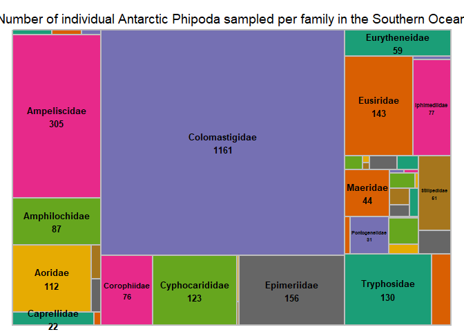
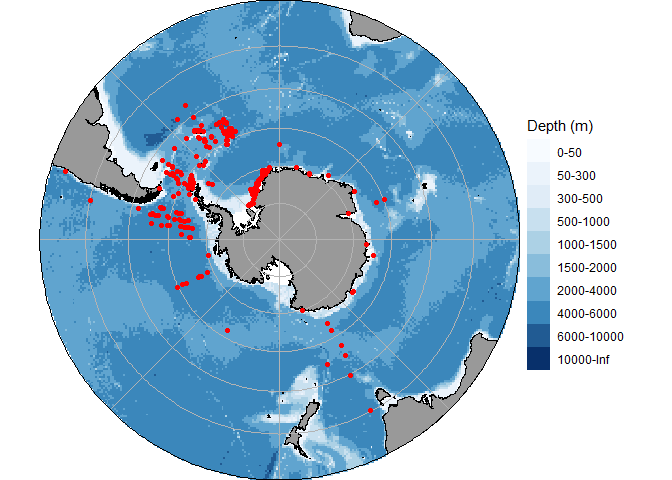

02_data_plots
================
Denisse Fierro Arcos
2023-09-24

- [Plotting Antarctic Phipoda data](#plotting-antarctic-phipoda-data)
  - [Loading libraries](#loading-libraries)
  - [Loading data](#loading-data)
  - [Plotting data](#plotting-data)

# Plotting Antarctic Phipoda data

The first notebook in this repository shows the quality control workflow
applied to the Antarctic Phipoda dataset available in GBIF. Here, we
will use the cleaned dataset to create some plots.

## Loading libraries

``` r
library(tidyverse)
library(treemap)
library(ggOceanMaps)
library(ggspatial)
```

## Loading data

Here we will load the cleaned dataset produced in the previous notebook.

``` r
ant_phi <- read_csv("../Data/Antarctic_Phipoda_GBIF_QC.csv")
```

    ## Warning: One or more parsing issues, call `problems()` on your data frame for details,
    ## e.g.:
    ##   dat <- vroom(...)
    ##   problems(dat)

    ## Rows: 2729 Columns: 57
    ## ── Column specification ────────────────────────────────────────────────────────
    ## Delimiter: ","
    ## chr  (32): language, license, collectionCode, basisOfRecord, dynamicProperti...
    ## dbl  (15): gbifID, organismQuantity, decimallatitude, decimallongitude, dept...
    ## lgl   (6): distanceFromCentroidInMeters, hasCoordinate, hasGeospatialIssues,...
    ## dttm  (4): modified, lastInterpreted, lastParsed, lastCrawled
    ## 
    ## ℹ Use `spec()` to retrieve the full column specification for this data.
    ## ℹ Specify the column types or set `show_col_types = FALSE` to quiet this message.

``` r
#Checking structure
glimpse(ant_phi)
```

    ## Rows: 2,729
    ## Columns: 57
    ## $ gbifID                       <dbl> 2858744108, 2858744107, 2858744106, 28587…
    ## $ language                     <chr> "English", "English", "English", "English…
    ## $ license                      <chr> "CC_BY_4_0", "CC_BY_4_0", "CC_BY_4_0", "C…
    ## $ modified                     <dttm> 2020-09-09, 2020-09-09, 2020-09-09, 2020…
    ## $ collectionCode               <chr> "RBINS", "RBINS", "RBINS", "RBINS", "RBIN…
    ## $ basisOfRecord                <chr> "HUMAN_OBSERVATION", "HUMAN_OBSERVATION",…
    ## $ dynamicProperties            <chr> "{gear:Scuba Diving sampling by hand}", "…
    ## $ occurrenceID                 <chr> "2438_MISTA_Antarctic_Phipoda:1153", "243…
    ## $ organismQuantity             <dbl> 1, 1, 1, 1, 1, 1, 1, 1, 1, 1, 1, 1, 1, 1,…
    ## $ organismQuantityType         <chr> "individual count", "individual count", "…
    ## $ occurrenceStatus             <chr> "PRESENT", "PRESENT", "PRESENT", "PRESENT…
    ## $ continent                    <chr> NA, NA, NA, NA, NA, NA, NA, NA, NA, NA, "…
    ## $ countryCode                  <chr> "AQ", "AQ", "AQ", "AQ", "AQ", "AQ", "AQ",…
    ## $ decimallatitude              <dbl> -74.46667, -74.16666, -74.66666, -74.6000…
    ## $ decimallongitude             <dbl> -29.70000, -29.70000, -29.70000, -29.7166…
    ## $ footprintWKT                 <chr> "POINT(-29.7000007629395 -74.466667175293…
    ## $ scientificNameID             <chr> "urn:lsid:marinespecies.org:taxname:17672…
    ## $ scientificName               <chr> "Eclysis K.H.Barnard, 1932", "Eclysis K.H…
    ## $ kingdom                      <chr> "Animalia", "Animalia", "Animalia", "Anim…
    ## $ phylum                       <chr> "Arthropoda", "Arthropoda", "Arthropoda",…
    ## $ class                        <chr> "Malacostraca", "Malacostraca", "Malacost…
    ## $ order                        <chr> "Amphipoda", "Amphipoda", "Amphipoda", "A…
    ## $ family                       <chr> "Stilipedidae", "Stilipedidae", "Stiliped…
    ## $ genus                        <chr> "Eclysis", "Eclysis", "Eclysis", "Eclysis…
    ## $ genericName                  <chr> "Eclysis", "Eclysis", "Eclysis", "Eclysis…
    ## $ specificEpithet              <chr> NA, NA, NA, NA, NA, NA, NA, NA, NA, NA, N…
    ## $ taxonRank                    <chr> "GENUS", "GENUS", "GENUS", "GENUS", "GENU…
    ## $ vernacularName               <chr> "Eclysis", "Eclysis", "Eclysis", "Eclysis…
    ## $ taxonomicStatus              <chr> "ACCEPTED", "ACCEPTED", "ACCEPTED", "ACCE…
    ## $ datasetKey                   <chr> "667e0044-3ff1-4365-8ecf-e637c7b31fa4", "…
    ## $ publishingCountry            <chr> "AQ", "AQ", "AQ", "AQ", "AQ", "AQ", "AQ",…
    ## $ lastInterpreted              <dttm> 2023-08-25 17:08:59, 2023-08-25 17:08:59…
    ## $ depth                        <dbl> 1188.0, 2004.0, 483.5, 705.5, 704.5, 799.…
    ## $ depthAccuracy                <dbl> 35.0, 8.0, 0.5, 6.5, 3.5, 5.5, 4.5, 5.5, …
    ## $ distanceFromCentroidInMeters <lgl> NA, NA, NA, NA, NA, NA, NA, NA, NA, NA, N…
    ## $ issue                        <chr> "COORDINATE_ROUNDED;GEODETIC_DATUM_ASSUME…
    ## $ hasCoordinate                <lgl> TRUE, TRUE, TRUE, TRUE, TRUE, TRUE, TRUE,…
    ## $ hasGeospatialIssues          <lgl> FALSE, FALSE, FALSE, FALSE, FALSE, FALSE,…
    ## $ taxonKey                     <dbl> 4315833, 4315833, 4315833, 4315833, 43158…
    ## $ acceptedTaxonKey             <dbl> 4315833, 4315833, 4315833, 4315833, 43158…
    ## $ kingdomKey                   <dbl> 1, 1, 1, 1, 1, 1, 1, 1, 1, 1, 1, 1, 1, 1,…
    ## $ phylumKey                    <dbl> 54, 54, 54, 54, 54, 54, 54, 54, 54, 54, 5…
    ## $ classKey                     <dbl> 229, 229, 229, 229, 229, 229, 229, 229, 2…
    ## $ orderKey                     <dbl> 1231, 1231, 1231, 1231, 1231, 1231, 1231,…
    ## $ familyKey                    <dbl> 4464, 4464, 4464, 4464, 4464, 4464, 4464,…
    ## $ genusKey                     <dbl> 4315833, 4315833, 4315833, 4315833, 43158…
    ## $ speciesKey                   <dbl> NA, NA, NA, NA, NA, NA, NA, NA, NA, NA, N…
    ## $ species                      <chr> NA, NA, NA, NA, NA, NA, NA, NA, NA, NA, N…
    ## $ acceptedScientificName       <chr> "Eclysis K.H.Barnard, 1932", "Eclysis K.H…
    ## $ verbatimScientificName       <chr> "Eclysis", "Eclysis", "Eclysis", "Eclysis…
    ## $ protocol                     <chr> "EML", "EML", "EML", "EML", "EML", "EML",…
    ## $ lastParsed                   <dttm> 2023-08-25 17:08:59, 2023-08-25 17:08:59…
    ## $ lastCrawled                  <dttm> 2023-01-05 11:59:01, 2023-01-05 11:59:01…
    ## $ repatriated                  <lgl> FALSE, FALSE, FALSE, FALSE, FALSE, FALSE,…
    ## $ level0Gid                    <lgl> NA, NA, NA, NA, NA, NA, NA, NA, NA, NA, N…
    ## $ level0Name                   <lgl> NA, NA, NA, NA, NA, NA, NA, NA, NA, NA, N…
    ## $ iucnRedListCategory          <chr> NA, NA, NA, NA, NA, NA, NA, NA, NA, NA, N…

## Plotting data

The first plot will show the number of individuals per family of
Antarctic Phipoda included in the dataset.

``` r
ant_phi %>% 
  select(family, verbatimScientificName) %>% 
  count(family, verbatimScientificName) %>% 
  ungroup() %>% 
  complete(verbatimScientificName, nesting(family)) %>% 
  group_by(family) %>%
  mutate(fam = sum(n, na.rm = T)) %>% 
  unite("family", family, fam, sep = "\n") %>% 
  treemap(., index = c("family"), vSize = "n",
          fontsize.labels = 10, fontcolor.labels = "black",
          align.labels = c("center", "center"),
          overlap.labels = 0.5, border.col = "grey", 
          palette = "Dark2", 
          title = "Number of individual Antarctic Phipoda sampled per family in the Southern Ocean")
```

<!-- -->

Now we can create a map of observations. We will create a map with a
South Pole Stereographic projection using the `ggOceanMaps` and
`ggspatial` libraries.

``` r
#First, we state the northern most limit for our map
#We also overlay the bathymetry
basemap(limits = -30, bathymetry = T)+
  #Now we overlay our data points
  geom_spatial_point(data = ant_phi, color = "red", crs = 4326,
                     aes(x = decimallongitude, y = decimallatitude))
```

<!-- -->

Any figures can be saved into memory using the `ggsave` function from
`ggplot2`.
